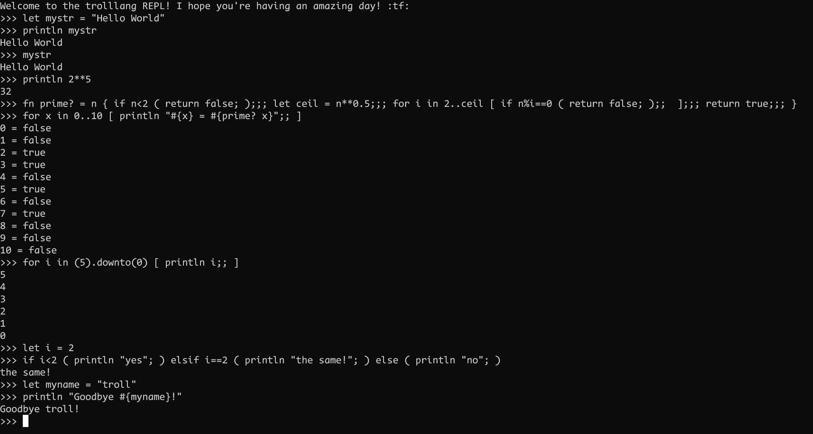

# The Nuni Programming Language
> ⚠️ **_WARNING:_** THIS LANGUAGE IS NOT FINISHED -> DO NOT USE FOR PRODUCTION OR SERIOUS USE CASES

"Nuni" is a programming language written in Ruby. I am writing this language for the sake of fun and studying the process of creating programming languages - meaning that this language shouldn't be used for serious business cases. I am still trying my best to make a small but interesting language! My goal is not to have an amazing looking and powerful language but to have fun!
I might add some fun syntax like `;;;`, `;;` and `;` delimiters and more to make the language sort of like a "challenge" to program in! 

## Hello World
```
let mystr = "Hello World"
println mystr
```
```
Hello World
```
## Running nuni code
```
ruby interpreter.rb <path-to-nunifile>
```
## Examples
### Basic arithmetic
```
println 2 + 5   // =>   7
println 2 - 5   // =>  -3
println 2 * 5   // =>  10
println 2 / 5.0 // => 0.4 (atleast one needs to be a float in order to show decimal precision)
println 2 % 5   // =>   2
println 2**5    // =>  32
```

### Comments
```
// prints hello world
println "Hello World"
```

### defining variables
> ⚠️ **_NOTE:_** Hashes are not yet supported. 
```
let favNumber = 1/7    // -> mutable
let PI = 3.14159265359 // -> immutable (constant)
let PI = 3.141	       // let's you change variable but sends warning (ruby-style)
```
```
./Examples/variables.rb:3: warning: already initialized constant PI
./Examples/variables.rb:2: warning: previous definition of PI was here
```

### data types
```
let myint = 1														// integer
let myfloat = 2.0                       // float
let myconst = 3.14159265359             // constant
let mybool = true                       // boolean
let myarr = [1, 2, 3, 4]                // array
let myarr2 = myarr.map { |n| n*2 }      // you can even use ruby code when declaring a variable!

println myint
println myfloat
println myconst
println mybool
println myarr
println myarr2
```

### defining and using functions
```
fn add = x, y { let sum = x+y;;; return sum;;; } // single line function definition
let sum = add 2, 5
println sum

let test = 7 + (add 2, 5)
println test
```
```
7
14
```

#### prime? example
```
fn prime? = n { if n<2 ( return false; );;; let ceil = n**0.5;;; for i in 2..ceil [ if n%i==0 ( return false; );;  ];;; return true;;; }
for x in 0..20 [ println "#{x} = #{prime? x}";; ]
```
```
0 = false
1 = false
2 = true
3 = true
4 = false
5 = true
6 = false
7 = true
8 = false
9 = false
10 = false
11 = true
12 = false
13 = true
14 = false
15 = false
16 = false
17 = true
18 = false
19 = true
20 = false
```

#### fib example
```
fn fib = n { if n<=1 ( return 1; );;; let result = fib(n-1)+fib(n-2);;; return result;;; }
for i in 0..20 [ println fib i;; ]
```
```
1
1
2
3
5
8
13
21
34
55
89
144
233
377
610
987
1597
2584
4181
6765
10946
```

### loops
#### for-loops
```
for i in 0..20 [ if i%2==0 ( println i; );; ]
```
```
0
2
4
6
8
10
12
14
16
18
20
```

### if-statements
```
let i = 2
if i<2 ( println "yes"; ) elsif==2 ( println "the same!"; ) else ( println "no"; )
```
```
the same!
```

### string interpolation / concatenation
You can just use the Ruby syntax!
```
let name = "Nuni"
let greet = "Hello #{name}!"
println greet
println "Goodbye #{name}!"
```
```
Hello Nuni!
Goodbye Nuni!
```

### embedding ruby
```
println "Hello Nuni"
# puts "Hello Ruby!"
# [1, 2, 3, 4].each do |n| puts n end
println 2+3
```
```
Hello Nuni
Hello Ruby!
1
2
3
4
5
```

## Future ideas (by priority)
fixed plans:
- [x] SINGLE-LINE function declaration with nuni syntax, Ex:
- [x] if-else statement
- [x] string interpolation / concatenation (you can just use the ruby `#{your_var}` syntax!)
- [x] ruby syntax embedding with `#` at the start of line
- [ ] loops
	- [ ] while
	- [x] for
	- [ ] foreach
- [ ] type hinting
- [ ] add option to translate to ruby or to just run the code
- [ ] importing other nuni programms
- [ ] implement std library in nuni
- [ ] a good and WORKING REPL

would be cool:
- [ ] structs or classes?
- [ ] MULTI-LINE function declaration with nuni syntax, Ex:
- [ ] MULTI-LINE if-else statements with nuni syntax

## using the REPL
The REPL is not my main priority so I would not recommend to use it since I haven't really worked on it seriously. 
```
ruby repl.rb
```

